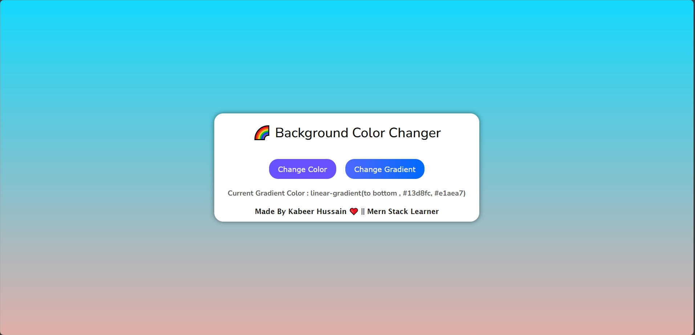

# 🎨 Background Color Generator (JavaScript Day 4)
**Live Demo:** 
[Click Here](https://color-changer-app-flame.vercel.app)

An elegant and interactive **Background Color Generator** built entirely with **pure JavaScript DOM manipulation**.  
Switch between random solid colors and beautiful gradients — all with smooth transitions and a responsive design.  

---

## 🚀 Features
✅ Generate random solid colors 🎨  
✅ Generate stunning gradients 🌈  
✅ Smooth transition animations  
✅ Live color code display  
✅ Fully responsive design (mobile-friendly)  
✅ Pure JavaScript — no HTML or CSS file used  
✅ Clean UI with hover and click effects  

---

## 🧱 Tech Stack & Architecture
- **Frontend:** JavaScript (DOM API + inline styling)
- **Dynamic Elements:** Created via `document.createElement()`  
- **Functions:**  
  - `changecolor()` → Generates random hex color  
  - `changegradient()` → Generates random gradient angles and colors  
- **Responsive Layout:** Adjusts buttons and text for small screens  
- **Styling Helper:** `sty()` custom function to apply multiple CSS styles  

---

## 🧠 How It Works
1. The app interface (heading, buttons, paragraph, footer) is generated dynamically using JavaScript.  
2. Clicking **Change Color** sets a new random background color using a hex value.  
3. Clicking **Change Gradient** applies a two-color gradient with random angles.  
4. The current color or gradient code is displayed live below the buttons.  
5. Layout and text automatically resize on smaller screens.  

---

## 💡 Learning Goals
This project helps you strengthen:
- JavaScript DOM Manipulation  
- Random color and gradient generation logic  
- Event handling and dynamic UI creation  
- Responsive styling using JavaScript  

---

## 📸 Preview

---

## 🛠️ Developer Info
👨‍💻 **Developer:** Kabeer Hussain  
📘 **Series:** JavaScript — *30 Days, 30 Projects*  
📆 **Day:** 4 — *Background Color Generator*  
📧 **Email:** codealpha0786@gmail.com  
🔗 **GitHub:** [ITechKabeer](https://github.com/ITechKabeer)

Made by Kabeer Hussain ❤️
